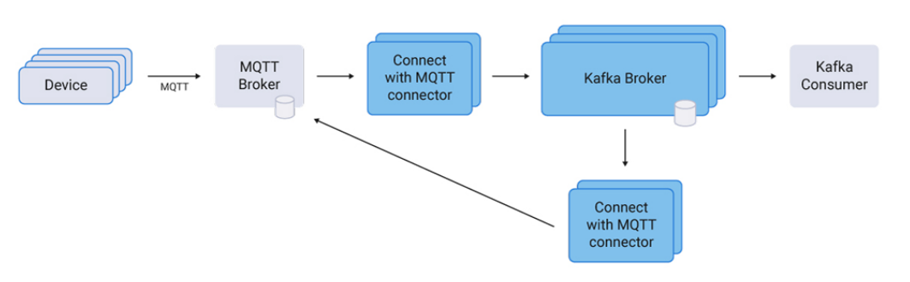
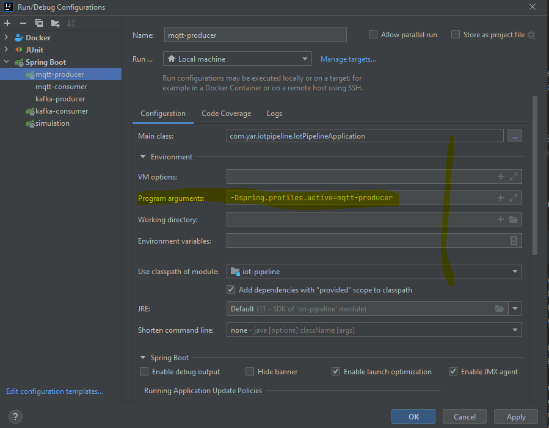

# IoT Pipeline

## Table of contents
* [Introduction](#Introduction)
* [Architecture](#Architect)
* [How to run](#How to run)
* [How to use](#How to use)

## Introduction
This application provide a serverless architect solution for an Iot pipeline.

## Architect
Diagram:
  

The pipeline application is written using Spring Boot. The application contains 5 profiles, which can be run individually or in combination. Each profile has a specific aim in this application.
*	simoulation: The simulation of devices to send their data into the MQTT broker. The client will be generated randomly and send their random data per minutes.
*	mqtt-producer: this profile will send the client data into HiveMQ
*	mqtt-consumer: This profile will send the data into the Kafka broker
*	kafka-producer: This profile will listen and consume the data from Kafka broker
*	kafka-consumer: This profile will run an agent to read data from Kafka and store it in the MongoDB

## How to run
It should be aware of the profiles and their aims before running, and it should select the ones that are required.

### Prerequirements:
* Java 11+
* Maven
* MongoDB
* HiveMQ Broker
* Kafka Broker

There is a docker compose file which will provide all required services by running the ‘docker compose up’ command.

### IDE
  Step 1 : Run maven command:
  
    >> mvn clean install spring-boot:run

  Step 2 : Declare required profiles as program argument:
    

Step 2 : Run IotPipelineApplication.java

### Maven
  Run below command:

    >> mvn clean install spring-boot:run

### Dockerization
Run the 'Dockerfile'

## How to use

After running the "GET /send/{clientId}" endpoint will be available. The every parameter can be send to this endpoint as a query param.

For example:
http://localhost:8080/send/689fef9f-7bf0-41ac-8d2a-78a656ede397?thermostat=50&heartRateMeter=30&carFuel=60&latitude=32.8635=&longitude=53.0944

